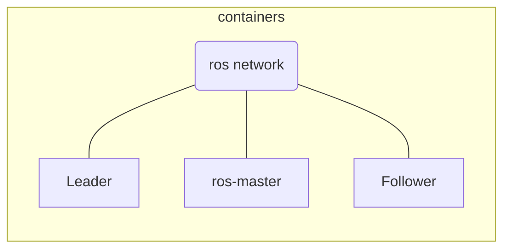
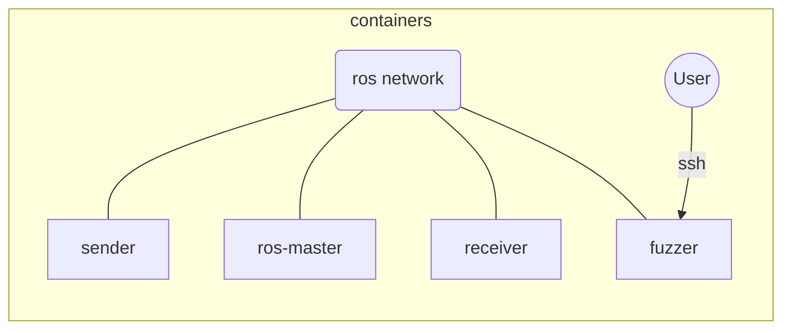

# Fuzzing Exercise made for the Winter School Cyberwal in Galaxia

The website of the school (https://cyberwalingalaxia.be/dashboard/) will provide the support of the lessons.

The support of the exercise will also be available there and a copy is available in the repo.

It is the second exercise of the 2 presented with the idea to go from certification to fuzzing test techniques.

# First 

The other part of the exercices is in a separate repo : https://github.com/cetic/certif-tp

## Scheme  

The exercise is based on a communication between 2 vehicles making a platoon and based on the Robot Operating System v1 Noetic : https://www.ros.org .

The idea is to make different fuzzing tests on the communication between the 2 vehicles.

## Setup

To set-up the environment, you can directly use the Dockerfile/Docker-compose file or directly use the Virtual Machine (ova file) provided [here](https://drive.google.com/drive/folders/1wknAG07w7pQ9p1FiZ4O7q6dyjJpGx3pF?usp=sharing). This machine can be imported in virtualbox or VMware.

For the docker version, simply build all the docker file then launch the docker-compose or use the launchTP.sh file.

the result will be a setup as described below with the sender representing the Leader car, the receiver representing the Follower car and a third container which can be accessed through SSH and contain all the tools necessary.

