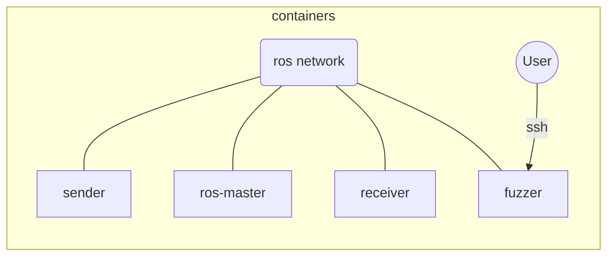
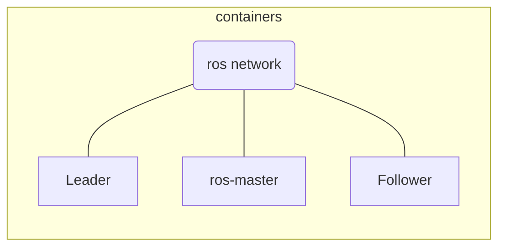

# WinterSchool TP fuzzing

## Meeting Notes

Plan : 
 - Intro 
   - Explication Use Case 
 - 2 niveaux : 
   - Fuzzing json sans protection 
     - fuzzer niveau string devrait trouver les erreurs
   - Fuzzing json avec certaines protection 
     - demande un fuzzer + évolué avec une grammaire

## Scheme  




## Description
Sender and receiver communicates using the ROS protocol. They exchanged a json stringlified containing 3 objects : 
 - Acceleration
 - Direction
 - Comment

### Sender
The sender generates random information for the Acceleration and Direction object.
The Comment object contains the Flag to catch when the communication is successfully spied.

### Receiver
The receiver process the json and outputs the received info in /var/log/ros/test.log using a shared volume on the machine.
It also processes the Direction object to make computation : it adds the received direction to a global saved direction.

### Fuzzer
The fuzzer is a container reachable through ssh on port 11322 and containing the necessary tools for the exercise.
It currently contains : 
 - ettercap
 - boofuzz
 - nano
 - ip-utils
 - nmap
 - tcpdump

 It has a ws user created with a defined password (see protected variable).
The command for the ssh connection is 
```bash 
ssh -p 11322 ws@[the ip address of the host machine]
```

An ettercap script was added for test that detects the sender and receiver internal addresses and make the man in the middle attack.
Currently it is define to use the test.filterfile as filter which will modify the messgae sent to the receiver.

